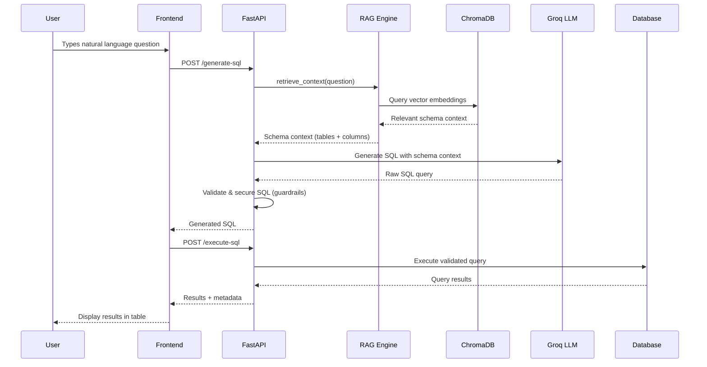

<div align="center">

# 🤖 AI-Powered Text-to-SQL RAG Chatbot

**Transform natural language questions into precise SQL queries using Retrieval-Augmented Generation**

[](https://python.org)
[](https://fastapi.tiangolo.com)
[](https://reactjs.org)
[](https://langchain.com)


<br/>

[**Features**](#-features) · [**Architecture**](#-architecture) · [**Quick Start**](#-quick-start) · [**API Reference**](#-api-reference) · [**Contributing**](#-contributing)

<br/>

</div>

---

## 📌 Overview

A full-stack, production-grade chatbot that translates plain English questions into SQL queries — powered by **RAG (Retrieval-Augmented Generation)**, **Groq's LLM API (Llama 3.1 8B)**, and **ChromaDB** vector embeddings. Connect to any **SQLite**, **PostgreSQL**, or **MySQL** database, ask questions in natural language, and get instant, validated SQL with real-time execution results.

> **Why RAG?** Instead of dumping the entire database schema into every LLM prompt, the RAG pipeline indexes your schema in ChromaDB and retrieves only the most relevant tables/columns per query — dramatically improving accuracy and reducing token costs.

---

## ✨ Features

### 🧠 Core Intelligence
| Feature | Description |
|---|---|
| **Natural Language → SQL** | Converts plain English to accurate SQL via Groq LLM (Llama 3.1 8B Instant) |
| **RAG-Powered Context** | ChromaDB vector store indexes schema & sample data for precise table/column retrieval |
| **Schema-Aware Generation** | Automatically detects tables, columns, types, and relationships to ground LLM output |
| **SQL Explanation** | One-click AI-powered breakdown of any SQL query — clause by clause |
| **Smart Suggestions** | Pre-built query suggestions to help users get started |

### 🔒 Enterprise Security
| Feature | Description |
|---|---|
| **SQL Validation & Guardrails** | Blocks `DROP`, `DELETE`, `TRUNCATE`, `ALTER`, `INSERT`, and other destructive operations |
| **Injection Prevention** | Detects and blocks SQL injection patterns (`UNION SELECT`, `--`, `/**/`, `SLEEP()`, etc.) |
| **Query Limits** | Auto-injects `LIMIT` clauses and caps maximum rows returned (configurable) |
| **System Table Protection** | Blocks access to `information_schema`, `pg_catalog`, `sys`, and other system schemas |
| **Multi-statement Blocking** | Prevents execution of chained SQL statements |

### 🗄️ Multi-Database Support
| Database | Driver | Status |
|---|---|---|
| **SQLite** | Built-in | ✅ Ready |
| **PostgreSQL** | `psycopg2` | ✅ Ready |
| **MySQL** | `pymysql` | ✅ Ready |

### 🎨 Modern Frontend
- **Dark / Light Theme** — seamless toggle with CSS custom properties
- **Schema-Aware Autocomplete** — type table/column names with real-time suggestions
- **SQL Syntax Highlighting** — color-coded SQL with line numbers
- **Query Cost Estimation** — instant complexity analysis before execution
- **Result Table with Animated Rows** — responsive data grid with row-slide animations
- **Export to CSV / JSON** — one-click data export
- **Query History** — persistent session history with restore capability
- **Real-Time Processing Timer** — live millisecond counter during query generation

---

## 🏗️ Architecture

```
┌─────────────────────────────────────────────────────────────────┐
│                        FRONTEND (React 18)                      │
│  ┌──────────┐ ┌──────────┐ ┌──────────┐ ┌──────────────────┐  │
│  │ ChatBox  │ │ Schema   │ │ Result   │ │ DB Settings      │  │
│  │ + Auto-  │ │ Panel    │ │ View     │ │ Panel            │  │
│  │ complete │ │          │ │ + Export │ │ (Connect/Test)   │  │
│  └────┬─────┘ └──────────┘ └──────────┘ └──────────────────┘  │
│       │              Axios HTTP                                 │
└───────┼─────────────────────────────────────────────────────────┘
        │
        ▼
┌─────────────────────────────────────────────────────────────────┐
│                    BACKEND (FastAPI + Uvicorn)                   │
│                                                                 │
│  ┌──────────────────────────────────────────────────────────┐  │
│  │                    API Layer (app.py)                     │  │
│  │  /generate-sql  /execute-sql  /explain-sql  /connect-db  │  │
│  │  /schema        /suggestions  /history      /rag/stats   │  │
│  └──────────────────────┬───────────────────────────────────┘  │
│                         │                                       │
│  ┌──────────────┐ ┌─────┴──────┐ ┌──────────────────────────┐  │
│  │ SQL Generator│ │ RAG Engine │ │  SQL Validator            │  │
│  │ (Mock + LLM) │ │ (ChromaDB) │ │  (Guardrails + LIMIT)    │  │
│  └──────┬───────┘ └─────┬──────┘ └──────────────────────────┘  │
│         │               │                                       │
│  ┌──────┴───────┐ ┌─────┴──────┐ ┌──────────────────────────┐  │
│  │ Groq LLM     │ │ Vector     │ │ DB Connector             │  │
│  │ Client       │ │ Store      │ │ (SQLAlchemy)             │  │
│  │ (Llama 3.1)  │ │ (ChromaDB) │ │ SQLite/PG/MySQL         │  │
│  └──────────────┘ └────────────┘ └──────────────────────────┘  │
│                                                                 │
│  ┌──────────────┐ ┌────────────┐ ┌──────────────────────────┐  │
│  │ Data Loader  │ │ Schema     │ │ Logger (Loguru)          │  │
│  │ (CSV/Excel)  │ │ Cache      │ │                          │  │
│  └──────────────┘ └────────────┘ └──────────────────────────┘  │
└─────────────────────────────────────────────────────────────────┘
```

---

## 🚀 Quick Start

### Prerequisites

- **Python 3.10+**
- **Node.js 18+** and **npm**
- A **Groq API key** ([get one free](https://console.groq.com/keys))

### 1. Clone the Repository

```bash
git clone https://github.com/your-username/AI-Powered-Text-to-SQL-RAG-Chatbot.git
cd AI-Powered-Text-to-SQL-RAG-Chatbot
```

### 2. Configure Environment Variables

```bash
cp .env.example .env
```

Edit `.env` and add your API key:

```env
GROQ_API_KEY=your_groq_api_key_here
```

### 3. Backend Setup

```bash
cd backend

# Create and activate virtual environment
python -m venv .venv
source .venv/bin/activate        # Linux / macOS
# .venv\Scripts\activate         # Windows

# Install dependencies
pip install -r requirements.txt

# Start the backend server
uvicorn app:app --host 0.0.0.0 --port 5000 --reload
```

The API will be available at `http://localhost:5000` with interactive docs at `http://localhost:5000/docs`.

### 4. Frontend Setup

```bash
cd frontend

# Install dependencies
npm install

# Start the development server
npm start
```

The app will open at `http://localhost:3000`.

---

## 🔌 Connecting a Database

1. Click **"Connect DB"** in the top-right of the UI
2. Select your database type (SQLite, PostgreSQL, or MySQL)
3. Enter connection credentials
4. Click **"Test Connection"** to verify
5. Click **"Connect"** — the schema is automatically indexed into ChromaDB for RAG

> **Tip:** The app ships with a default SQLite database. For PostgreSQL, ensure `psycopg2-binary` is installed.

---

## 📡 API Reference

| Method | Endpoint | Description |
|---|---|---|
| `GET` | `/` | Health check |
| `GET` | `/status` | Server status |
| `POST` | `/generate-sql` | Convert natural language to SQL (RAG-powered) |
| `POST` | `/execute-sql` | Validate and execute SQL against the connected DB |
| `POST` | `/explain-sql` | Get AI-powered clause-by-clause SQL explanation |
| `POST` | `/test-connection` | Test database connectivity |
| `POST` | `/connect-db` | Connect to DB and index schema into RAG |
| `GET` | `/schema` | Get parsed schema of the connected database |
| `GET` | `/suggestions` | Get sample query suggestions |
| `GET` | `/history` | Retrieve query history |
| `POST` | `/history` | Save a query to history |
| `GET` | `/rag/stats` | RAG index statistics |
| `POST` | `/rag/reindex` | Force re-index schema into ChromaDB |

> Full interactive API docs available at `/docs` (Swagger UI) when the backend is running.

---

## 🧪 Running Tests

```bash
cd backend

# Run all tests with coverage
pytest --cov=. --cov-report=html -v

# Run specific test suites
pytest tests/test_endpoints.py -v    # API endpoint tests
pytest tests/test_database.py -v     # Database connector tests
pytest tests/test_ai.py -v           # AI/LLM integration tests
```

---

## 📁 Project Structure

```
text-to-sql-chatbot/
├── backend/
│   ├── app.py                 # FastAPI application & route definitions
│   ├── config.py              # Environment-based configuration management
│   ├── requirements.txt       # Python dependencies
│   ├── pyproject.toml         # Project metadata, linting & build config
│   ├── services/
│   │   ├── sql_generator.py   # Core SQL generation (Mock + LLM backends)
│   │   ├── rag_engine.py      # RAG pipeline — ChromaDB indexing & retrieval
│   │   ├── groq_llm_client.py # Groq API client (Llama 3.1 8B)
│   │   ├── db_connector.py    # SQLAlchemy multi-DB connector
│   │   ├── sql_validator.py   # SQL guardrails & security validation
│   │   ├── data_loader.py     # CSV/Excel → Database loader
│   │   └── utils.py           # Shared utilities, schema cache, decorators
│   ├── models/                # Pydantic models & data schemas
│   ├── tests/                 # Pytest test suites
│   ├── logger/                # Loguru-based logging configuration
│   └── data/                  # SQLite DB, ChromaDB persistence, uploads
│
├── frontend/
│   ├── package.json           # React app dependencies
│   └── src/
│       ├── App.js             # Main application component
│       ├── App.css            # Global styles (dark/light themes)
│       ├── components/
│       │   ├── ChatBox.js         # NL input with schema-aware autocomplete
│       │   ├── ResultView.js      # SQL display, results table, tabs
│       │   ├── SchemaPanel.js     # Database schema explorer sidebar
│       │   ├── DBSettingsPanel.js # Database connection configuration
│       │   ├── ExplainTab.js      # AI-powered SQL explanation view
│       │   ├── HistoryTab.js      # Query history with restore
│       │   ├── HighlightedSQL.js  # SQL syntax highlighter
│       │   ├── QueryCostBanner.js # Query complexity estimator
│       │   └── EmptyState.js      # Welcome screen / empty state
│       ├── contexts/
│       │   └── ThemeContext.js # Dark/light theme provider
│       └── utils/
│           ├── schemaUtils.js # Schema parsing utilities
│           └── sqlUtils.js    # SQL analysis & cost estimation
│
├── scripts/                   # Dev scripts (setup, test runners)
├── docs/                      # Documentation
├── .env.example               # Environment variable template
├── Dockerfile                 # Container build (planned)
├── docker-compose.yml         # Container orchestration (planned)
└── .gitignore
```

---

## ⚙️ Configuration

All configuration is driven by environment variables. See [`.env.example`](.env.example) for the full list.

| Variable | Default | Description |
|---|---|---|
| `GROQ_API_KEY` | — | **Required.** Your Groq API key |
| `DB_TYPE` | `sqlite` | Default database type |
| `DEBUG` | `True` | Enable debug mode |
| `PORT` | `5000` | Backend server port |
| `LOG_LEVEL` | `DEBUG` | Logging verbosity |
| `USE_MOCK_LLM` | `False` | Use mock responses (no API calls) |
| `OPENAI_API_KEY` | — | Optional: OpenAI API key |
| `HF_API_KEY` | — | Optional: HuggingFace API key |
| `OLLAMA_BASE_URL` | `http://localhost:11434` | Optional: Local Ollama endpoint |

---

## 🛠️ Tech Stack

| Layer | Technology |
|---|---|
| **LLM** | Groq API — Llama 3.1 8B Instant |
| **RAG / Embeddings** | ChromaDB + Sentence Transformers (`all-MiniLM-L6-v2`) |
| **Backend Framework** | FastAPI + Uvicorn |
| **ORM / DB** | SQLAlchemy 2.0 (SQLite, PostgreSQL, MySQL) |
| **Data Processing** | Pandas, NumPy, OpenPyXL |
| **Frontend** | React 18, Axios |
| **Styling** | CSS Custom Properties (dark/light themes) |
| **Logging** | Loguru |
| **Testing** | Pytest + pytest-cov |
| **Linting** | Ruff, Black, MyPy |

---

## 🔄 How It Works



---

## 🤝 Contributing

Contributions are welcome! Here's how to get started:

1. **Fork** the repository
2. **Create** a feature branch: `git checkout -b feature/amazing-feature`
3. **Commit** your changes: `git commit -m 'Add amazing feature'`
4. **Push** to the branch: `git push origin feature/amazing-feature`
5. **Open** a Pull Request

### Development Tools

```bash
# Format code
black backend/ --line-length 100

# Lint code
ruff check backend/

# Type checking
mypy backend/
```

---


---

## 👤 Author

**Santhosh**
- 📧 [s.santhosh222004@gmail.com](mailto:s.santhosh222004@gmail.com)
- 🔗 [GitHub](https://github.com/your-username)

---

<div align="center">

**⭐ Star this repo if you found it useful!**

Built with ❤️ using FastAPI, React, ChromaDB, and Groq

</div>
